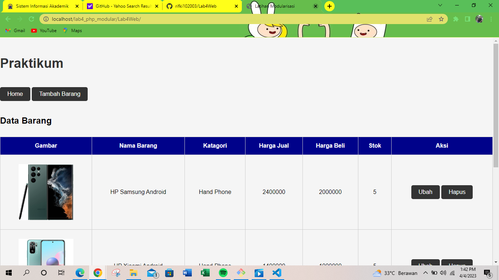

# Lab4Web
# PRAKTIKUM 4
# PHP MODULAR
Berikut Penjelasan nya

# Header
    <?php
    include("koneksi.php");

    // query untuk menampilkan data
    $sql = 'SELECT * FROM data_barang';
    $result = mysqli_query($conn, $sql);
    ?>

    <!DOCTYPE html>
    <html lang="en">
    <head>
        <meta charset="UTF-8">
        <title>Latihan Modularisasi</title>
        <link href="style.css" rel="stylesheet" type="text/css"/>
    </head>
    <body>
        

        <header>
            <h1>Praktikum </h1>
        </header>
        <nav>
            <a href="home.php">Home</a>
            <a href="tambah.php">Tambah Barang</a>
        </nav>
     
# Footer
    <footer>
            
&copy; 2023 - Teknik Informatika - Universitas Pelita Bangsa

    </footer>
    

    </body>
    </html>
# Home
    <?php require('header.php'); ?>

    

    <h2>Data Barang</h2>
        

            <table>
            <tr>
                <th>Gambar</th>
                <th>Nama Barang</th>
                <th>Katagori</th>
                <th>Harga Jual</th>
                <th>Harga Beli</th>
                <th>Stok</th>
                <th>Aksi</th>
            </tr>
            <?php if($result): ?>
            <?php while($row = mysqli_fetch_array($result)): ?>
            <tr>
                <td>" alt="<?=$row['nama'];?>"></td>
                <td><?= $row['nama'];?></td>
                <td><?= $row['kategori'];?></td>
                <td><?= $row['harga_jual'];?></td>
                <td><?= $row['harga_beli'];?></td>
                <td><?= $row['stok'];?></td>
                <td>
                    <a href="ubah.php?id=<?= $row['id_barang'];?>">Ubah</a>
                    <a href="hapus.php?id=<?= $row['id_barang'];?>">Hapus</a> 
                </td>
            </tr>
            <?php endwhile; else: ?>
            <tr>
                <td colspan="7">Belum ada data</td>
            </tr>
            <?php endif; ?>
            </table>
        

    

    <?php require('footer.php'); ?>
# index
    <?php

    $mod = @$_REQUEST['mod'];

    switch ($mod) {
        case "home":
            require("home.php");
            break;
        case "tambah":
            require("tambah.php");
            break;
    default:
        require("home.php");
    }
    ?>

# Hapus
    <?php
    include_once 'koneksi.php';
    $id = $_GET['id'];
    $sql = "DELETE FROM data_barang WHERE id_barang = '{$id}'";
    $result = mysqli_query($conn, $sql);
    header('location: home.php');
    ?>
# Tambah
    <?php
    error_reporting(E_ALL);
    include_once 'koneksi.php';
    if (isset($_POST['submit'])) {
        $nama = $_POST['nama'];
        $kategori = $_POST['kategori'];
        $harga_jual = $_POST['harga_jual'];
        $harga_beli = $_POST['harga_beli'];
        $stok = $_POST['stok'];
        $file_gambar = $_FILES['file_gambar'];
        $gambar = null;
        if ($file_gambar['error'] == 0) {
            $filename = str_replace(' ', '_', $file_gambar['name']);
            $destination = dirname(__FILE__) . '/gambar/' . $filename;
            if (move_uploaded_file($file_gambar['tmp_name'], $destination)) {
                $gambar = 'gambar/' . $filename;;
            }
        }
        $sql = 'INSERT INTO data_barang (nama, kategori,harga_jual, harga_beli, 
    stok, gambar) ';
        $sql .= "VALUE ('{$nama}', '{$kategori}','{$harga_jual}', 
    '{$harga_beli}', '{$stok}', '{$gambar}')";
        $result = mysqli_query($conn, $sql);
        header('location: index.php');
    }
    ?>
    <!DOCTYPE html>
    <html lang="en">

    <head>
        <meta charset="UTF-8">
        <link href="style.css" rel="stylesheet" type="text/css" />
        <title>Tambah Barang</title>
    </head>

    <body>
        

            <h1>Tambah Barang</h1>
            

                <form method="post" action="tambah.php" enctype="multipart/form data">
                    

                        <label>Nama Barang</label>
                        <input type="text" name="nama" />
                    

                    

                        <label>Kategori</label>
                        <select name="kategori">
                            <option value="Komputer">Komputer</option>
                            <option value="Elektronik">Elektronik</option>
                            <option value="Hand Phone">Hand Phone</option>
                        </select>
                    

                    

                        <label>Harga Jual</label>
                        <input type="text" name="harga_jual" />
                    

                    

                        <label>Harga Beli</label>
                        <input type="text" name="harga_beli" />
                    

                    

                        <label>Stok</label>
                        <input type="text" name="stok" />
                    

                    

                        <label>File Gambar</label>
                        <input type="file" name="file_gambar" />
                    

                    

                        <input type="submit" name="submit" value="Simpan" />
                    

                </form>
            

        

    </body>
    </html>
 # BERIKUT ADALAH HASIL ATAU OUTPUTNYA

# SEKIAN DAN TERIMAKASIH
